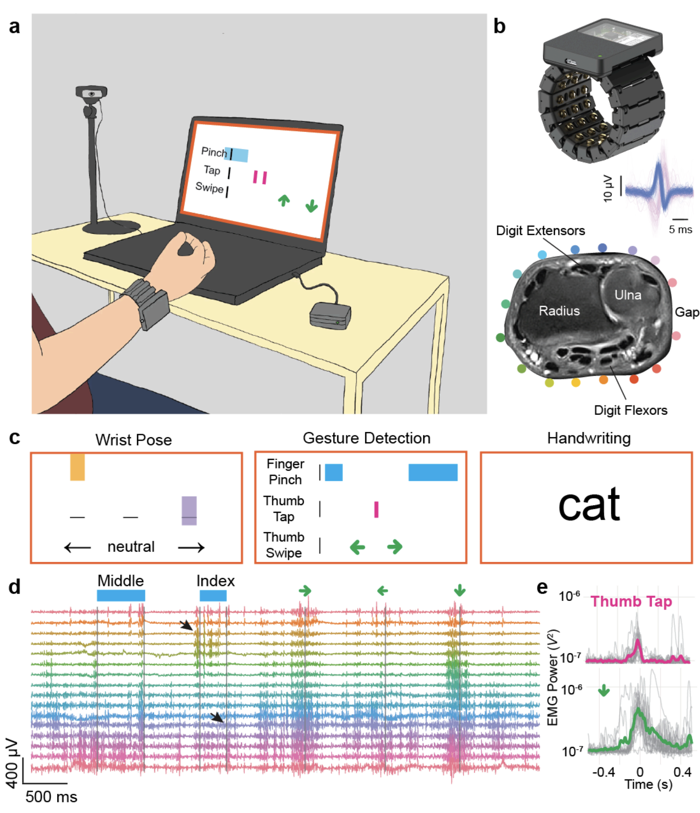

# ["A generic noninvasive neuromotor interface for human-computer interaction"](https://www.biorxiv.org/content/10.1101/2024.02.23.581779v1.full.pdf)

This repo is for loading and plotting surface electromyography (sEMG) data associated with the paper ["A generic noninvasive neuromotor interface for human-computer interaction"](https://www.biorxiv.org/content/10.1101/2024.02.23.581779v1.full.pdf).

The dataset contains 100 sEMG recordings for each of the three tasks described in the paper: `discrete_gestures`, `handwriting`, and `wrist`. Each recording is packaged in an `hdf5` file. This repo contains utility functions for loading and plotting these recordings.



## Download the data

> The instructions on this page are for MacOS.

Download the full dataset (21.5 GiB) with following command and then extract the file.

```bash
cd ~ && curl https://fb-ctrl-oss.s3.amazonaws.com/neuromotor-data/emg_data.tar.gz -o emg_data.tar.gz
```

Alternatively, you can download a smaller version of the dataset with only five recordings per task (667 MiB) to quickly get started.

```bash
cd ~ && curl https://fb-ctrl-oss.s3.amazonaws.com/neuromotor-data/emg_data_small.tar.gz -o emg_data_small.tar.gz
```

## Setup

> NOTE: The github repo described in this section will be made available upon publication of the paper.

Download the `generic-neuromotor-interface-data` repo and move it to your home directory.

Now setup the conda environment and install the local package.

```bash
# Setup and activate the environment
cd ~/generic-neuromotor-interface-data
conda env create -f environment.yml
conda activate neuromotordata

# Install the generic-neuromotor-inferface-data package
pip install -e .
```

## Run the notebook

Finally, use the `loading_emg_data.ipynb` notebook to see how data can be loaded and plotted.

```bash
jupyter lab loading_emg_data.ipynb
```

## Dataset details

sEMG is sampled at 2 kHz and is expressed in volts. No software filtering is applied. Timestamps are expressed in seconds and begin at $0$. A `stages` dataframe is included in each dataset that encodes the time of each stage of the experiment (see `loading_emg_data.ipynb` for more details). Specifics for each task are as follows.

### Discrete gestures

Datasets include the `name` of each gesture and the `time` at which it occured. Stage names include the types of gestures performed in each stage, as well as the posture (e.g. `static_arm_in_front`, `static_arm_in_lap`, ...)

### Handwriting

Handwriting datasets include the `start` and `end` time of each prompt. `start` is the time the prompt appears, and `end` is the time at which participants finished writing the prompt. Stage names describe the types of prompts in each stage (e.g. `words_with_backspace`, `three_digit_numbers`, ...).

### Wrist

Wrist angle datasets also include wrist angles measurements, which are upsampled to match the 2 kHz EMG sampling rate. Stage names include information about the type of task and movement in each stage (e.g. `cursor_to_target_task_horizontal_low_gain_screen_4`, `smooth_pursuit_task_high_gain_1`, ...).
